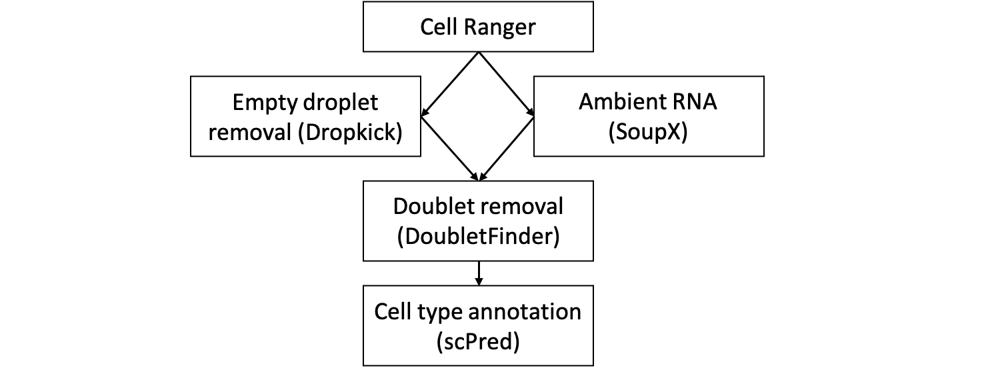
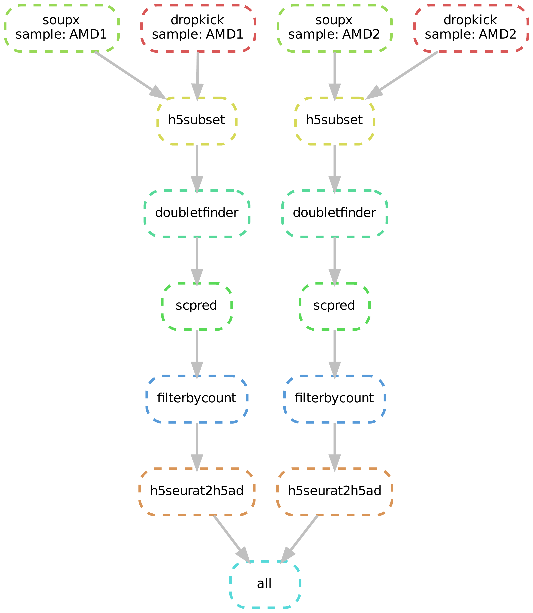

# cellqc: standardized quality control pipeline of single-cell RNA-Seq data

Cellqc standardizes the qualiy control of single-cell RNA-Seq (scRNA) data to render clean feature count matrices from Cell Ranger outputs. Cellqc is implemented using the Snakemake workflow management system to enhance reproduciblity and scalablity of data analysis. Briefly, the QC pipeline starts from raw count feature matrices from Cell Ranger. Dropkick filters out predicted empty droplets, and SoupX purify the transcriptome measurement by substracting the background trancripts. DoubletFinder further detects the potential doublets and retain clean count feature matrices for singlets. Cell types are annotated for clean cells by a reference database using scPred.



## Installation

It is easy to install cellqc via [conda](https://docs.conda.io/en/latest/miniconda.html) at https://anaconda.org/bioconda/cellqc. To use the full function of cellqc, please also install several dependencies outside conda. It is encouraged to use the C++ implementation [mamba](https://github.com/mamba-org/mamba) to speed up the installation. E.g.,

```
conda config --add channels defaults --add channels bioconda --add channels conda-forge
mamba create -n cellqc cellqc python=3.10
conda activate cellqc

# Downgrade Seurat for seurat-disk, as Seurat v5 is not supported in SeuratDisk. A new Seurat is not necessary.
mamba install r-seurat=4 r-seuratobject=4 r-matrix=1.6.1

# Build from source
Rscript -e "remotes::install_github(c('mojaveazure/seurat-disk', 'immunogenomics/harmony', 'powellgenomicslab/scPred'), upgrade=F)"

# Bug fix @counts for Seurat object, instead of chris-mcginnis-ucsf/DoubletFinder
Rscript -e "remotes::install_github('lijinbio/DoubletFinder', upgrade=F, force=T)"

# Downgrade dependencies for dropkick
mamba install numpy=1.21 scanpy=1.9.1 matplotlib=3.6 anndata=0.7.8 pandas=1.5
pip install dropkick

pip install -U cellqc # to install the latest version
```

Dependent software are summarized below.

| Software | URL |
|-------|-------|
| DoubletFinder | https://github.com/chris-mcginnis-ucsf/DoubletFinder |
| DropletUtils | https://bioconductor.org/packages/release/bioc/html/DropletUtils.html |
| Seurat | https://satijalab.org/seurat |
| SeuratDisk | https://github.com/mojaveazure/seurat-disk |
| SoupX | https://github.com/constantAmateur/SoupX |
| scPred | https://github.com/powellgenomicslab/scPred |
| Snakemake | https://github.com/snakemake/snakemake |
| Scanpy | https://scanpy.readthedocs.io/en/stable |
| dropkick | https://github.com/KenLauLab/dropkick |

To test the installation, simply run

```
cellqc -h
```

## Run the pipeline

`Cellqc` requires a sample file for sample information and an optional configuration file for pipeline parameters.

- The sample file (e.g., `samples.txt`) is a tab-delimited file with headers: `sample`, `cellranger`, and/or `nreaction`.
    - The `sample` column is the sample ID per sample.
    - The `cellranger` is the Cell Ranger output directory. See [Cell Ranger Outputs](https://support.10xgenomics.com/single-cell-gene-expression/software/pipelines/latest/output/gex-outputs) for an example directory.
    - The optional third column `nreaction` is the number of reactions in the library preparation, which is useful to infer expected doublets for a sample with a Cell Ranger analysis using combined raw reads from multiple reactions. If the `nreaction` column is not specified in the sample file, the default 1 reaction is used for all samples.

- A configuration file is in the YAML format. It is optional. The default parameters can be used as below. See the next section for the inspection of configuration.

```
dropkick:
  skip: false
  method: multiotsu
  numthreads: 1
filterbycount:
  mincount: 500
  minfeature: 300
  mito: 10
doubletfinder:
  skip: false
  findpK: false
  numthreads: 5
  pK: 0.01
scpred:
  skip: true
  reference: /path_to_reference/scPred_trainmodel_RNA_svmRadialWeights_scpred.rds
  threshold: 0.9
```

### Inspection of configuration

The configuration file is in a YAML format. An example configuration can be found at the example directory. 

1. dropkick

This section defines parameters for empty droplet removal by dropkick.

| Parameter | Description |
|-------|-------|
| dropkick.skip | Skip [Dropkick](https://github.com/KenLauLab/dropkick) and use the estimated cells from Cell Ranger alone (using [EmptyDrops](https://support.10xgenomics.com/single-cell-gene-expression/software/pipelines/latest/algorithms/overview#cell_calling)) if set `true`. If set `false`, to estimate further empty droplets by Dropkick. Be cautious that Dropdick might predict a significant number of false negatives for a poor library. |
| dropkick.method | The thresholding method for labeling the training data for true cells, such as multiotsu, otsu, li, or mean. |
| dropkick.numthreads | Number of threads. Dropkick will use significant memory. One thread is suggested for this step. |

2. filterbycount

To filter cells by nCount, nFeature, and percentage of mitochondria reads.

| Parameter | Description |
|-------|-------|
| filterbycount.mincount | Minimum counts for a cell. |
| filterbycount.minfeature | Minimum features for a cell. |
| filterbycount.mito | Maximum percentage of mitocondria transcripts. |

3. doubletfinder

This section includes three parameters for doublet removal by DoubletFinder.

| Parameter | Description |
|-------|-------|
| doubletfinder.skip | Skip doublet detection and removal. |
| doubletfinder.findpK | To estimate the neighbor size (pK) by mean-variance bimodality coefficients if `true`. If set `false`, skip the estimation and use the preset pK value. |
| doubletfinder.numthreads | Number of threads. |
| doubletfinder.pK | A preset neighbor size (pK). Will be used if `doubletfinder.findpK=false`. |

4. scpred

A pre-trained classifier for cell-type annotation by scPred.

| Parameter | Description |
|-------|-------|
| scpred.skip | Skip the automated cell type prediction by scPred if `true`. This is useful for a sample without a pre-trained reference. |
| scpred.reference | The pre-trained reference classifier saved in a RDS file. See https://github.com/powellgenomicslab/scPred |
| scpred.threshold | Threshold for a positive prediction. |

### Result files

Three result files are generated under a `result` subdirectory. `result/*.h5seurat` and `result/*.h5ad` files are count matrices after processing with QC metrics such as "pANN" for proportion of artificial nearest neighbors, and/or "scpred_prediction" for predicted cell type. A report file `result/report.html` is a summary of QC metrics. A `postproc` subdirectory with `postproc/*.h5ad` files is also generated for basic post-processing. This includes adding a prefix to the cell barcode, ensuring unique variable names, and cleaning the `raw` layer from the .h5ad file.

### An example

This example demonstrates the pipeline on two AMD samples. The test data consists of Cell Ranger output directories of two AMD samples, as well as a pretrained calssifier for cell-type annotation.

https://bcm.box.com/s/nnlmgxh8avagje93cih20g1dsxx14if4

After feeding the file locations, a sample file (e.g., `samples.txt`) looks like below.

```samples.txt
sample	cellranger
AMD1	/path/to/cellranger/AMD1/outs
AMD2	/path/to/cellranger/AMD2/outs
```

Below command is to run the pipeline by the installed entrypoint `cellqc`.

```
cellqc -d "$outdir" -t 8 -- samples.txt # with default parameters
cellqc -d "$outdir" -t 8 -c config.yaml -- samples.txt # by customized parameters in config.yaml
```

A directed acyclic graph (DAG) of jobs will be generated. For example,



A report of result files will be also produced, such as [report.html](https://github.com/lijinbio/cellqc/blob/master/docs/tests/report.html).

