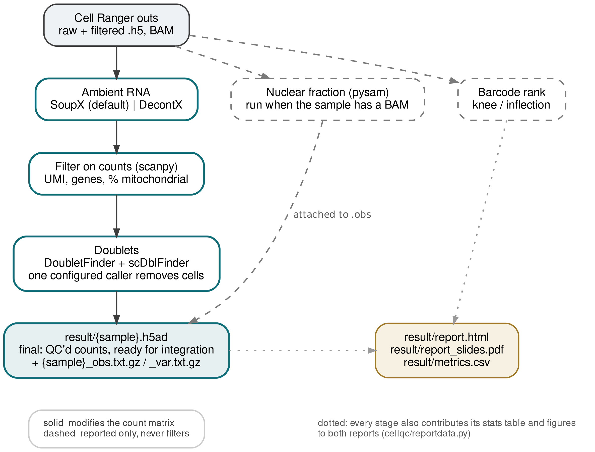
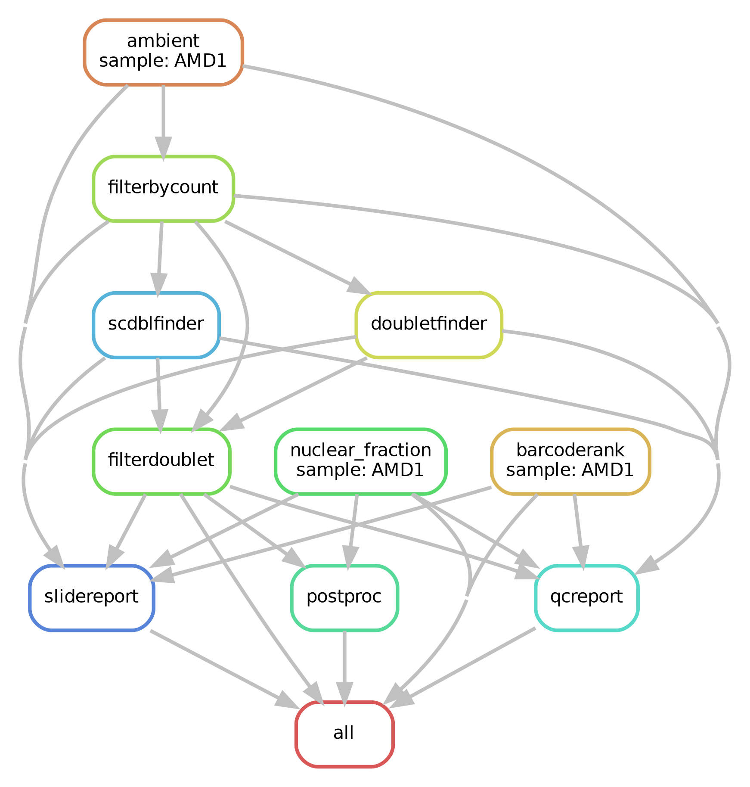

# cellqc: standardized quality control pipeline of single-cell RNA-Seq data

Cellqc standardizes the quality control of single-cell RNA-Seq (scRNA) data, turning Cell Ranger output
into clean feature count matrices. It is implemented in Snakemake for reproducibility and scalability.

The pipeline starts from the Cell Ranger filtered matrix and, per sample:

1. **Ambient RNA** — SoupX (default) or DecontX estimates background contamination and subtracts it. Other
   methods can be run alongside for comparison without touching the counts.
2. **Filtering** — cells are removed on total UMI, detected genes and mitochondrial percentage, with every
   exclusion attributed to a specific criterion.
3. **Doublets** — DoubletFinder and/or scDblFinder. All callers score every cell; one configured caller
   decides removal.
4. **Nuclear fraction** — the intronic read fraction per cell, from the Cell Ranger BAM, computed when a
   BAM is present. Reported, not used for filtering.

Output is `.h5ad` matrices, a self-contained HTML report, and a presentation-ready PDF slide deck.

Cell calling is Cell Ranger EmptyDrops; cellqc does not re-call cells. Cell-type annotation is out of
scope as of v0.2.0 — annotate downstream.



Both figures in `docs/` are generated from source by `bash docs/make_figures.sh` — `workflow.png` from
`docs/workflow.dot`, and the job DAG below straight from the workflow itself.

## Installation

Everything comes from one conda environment. The only component that is not conda-installable is
DoubletFinder, which is GitHub-only.

```
mamba env create -n cellqc -f envs/cellqc.yaml
conda activate cellqc

# DoubletFinder is not packaged for conda
Rscript -e "remotes::install_github('chris-mcginnis-ucsf/DoubletFinder', upgrade=FALSE)"

pip install -U cellqc
```

If you would rather avoid the GitHub build entirely, set `doublet.run: [scdblfinder]` and
`doublet.decider: scdblfinder` in the config; scDblFinder comes from bioconda.

v0.2.0 removed five of the six GitHub builds v0.1.0 needed (SeuratDisk, harmony, scPred, DropletQC and the
`lijinbio/DoubletFinder` fork) and all four version pins (Seurat v4, `r-matrix`, `pandas<2`, `anndata`).

Dependent software:

| Software | Role | Source |
|-------|-------|-------|
| Snakemake | workflow engine | conda |
| SoupX | ambient RNA correction (default) | conda |
| DecontX (celda) | ambient RNA correction (alternative) | conda |
| Scanpy / AnnData | filtering, I/O | conda |
| pysam | nuclear fraction from the Cell Ranger BAM | conda |
| Seurat | doublet detection backend | conda |
| zellkonverter | `.h5ad` -> R, native reader | conda |
| scDblFinder | doublet detection | conda |
| DropletUtils | 10x matrix I/O | conda |
| tectonic | builds the PDF slide report | conda |
| **DoubletFinder** | **doublet detection (default caller)** | **GitHub only** |

To test the installation:

```
cellqc -h
```

## Run the pipeline

`cellqc` requires a sample file and an optional configuration file.

- The sample file (e.g. `samples.txt`) is tab-delimited with headers `sample`, `cellranger`, and
  optionally `nreaction`.
    - `sample` is the sample ID.
    - `cellranger` is the Cell Ranger output directory. Relative paths are resolved against the
      **sample file's** directory.
    - `nreaction` is the number of reactions in the library prep, used to infer the expected doublet
      rate when one Cell Ranger run combines several reactions. Defaults to 1.

- The configuration file is YAML and optional. The defaults are:

```yaml
seed: 42                  # every stochastic step is seeded; v0.1.0 seeded nothing
ambient:
  method: soupx           # soupx | decontx | none -- the ONE method applied to the counts
  compare: []             # e.g. [decontx] -- estimated and reported, never applied
nuclear_fraction:         # runs automatically when the sample has an indexed BAM
  numthreads: 12
  cbtag: CB
  retag: RE
  exontag: E
  introntag: N
filterbycount:
  mincount: 500
  minfeature: 300
  mito: 10
doublet:
  run: [doubletfinder, scdblfinder]   # callers to execute
  decider: doubletfinder              # the single caller whose call removes cells
  findpK: false
  numthreads: 5
  pK: 0.01
  rate: 0.1               # 10x multiplet rate at `capacity` cells recovered
  capacity: 13000
```

### Inspection of configuration

1. `ambient` — ambient RNA correction

| Parameter | Description |
|-------|-------|
| ambient.method | The one method whose corrected counts are written: `soupx`, `decontx`, or `none`. |
| ambient.compare | Methods run for their contamination estimate only. They never modify counts; they exist so disagreement between methods is visible. Choosing a correction after seeing which one flatters the downstream result is not supported by design. |

2. `nuclear_fraction`

Fraction of intronic reads per cell, `intronic / (intronic + exonic)`, computed from the Cell Ranger BAM
with pysam. There is **no skip flag**: the step runs for any sample with an indexed
`possorted_genome_bam.bam` and is dropped for those without, so mixed cohorts work. The result is
reported and plotted against log10(UMI) but is **not used for filtering** — DropletQC-style empty-drop and
damaged-cell thresholds are sample- and tissue-dependent, so applying them automatically would be
unreviewed auto-filtering.

3. `filterbycount`

| Parameter | Description |
|-------|-------|
| filterbycount.mincount | Minimum total UMI per cell. |
| filterbycount.minfeature | Minimum detected genes per cell. |
| filterbycount.mito | Maximum percentage of mitochondrial counts. |

4. `doublet`

There is **no skip flag**, for the same reason `nuclear_fraction` has none: what runs is the list of
callers, and a caller you do not want is left out of `doublet.run`. Doublet detection itself always runs.

| Parameter | Description |
|-------|-------|
| doublet.run | Which callers to execute: any of `doubletfinder`, `scdblfinder`. Every caller's score and class are written to `.obs` under namespaced columns. |
| doublet.decider | The single caller whose call removes cells. Keeping the decision with one caller avoids an undeclared ensemble: a union removes more cells than the assumed multiplet rate, an intersection fewer. |
| doublet.findpK | Estimate pK by mean-variance bimodality coefficient (DoubletFinder only). |
| doublet.pK | Preset neighbourhood size, used when `findpK: false`. |
| doublet.rate, doublet.capacity | Expected doublet fraction is `rate * ncell / (nreaction * capacity)`. Hard-coded in v0.1.0; exposed so the assumption is visible. |

Both callers are given the same expected doublet rate, so a difference between them reflects the methods
rather than differing priors. Their concordance (2×2 table and Cohen's κ) is reported. **Concordance is a
consistency measure, not an accuracy measure** — with no ground-truth doublets, neither caller can be
shown superior on real data.

Note that homotypic doublets are **not** modelled (`modelHomotypic` is deliberately not called), so the
expected count over-estimates the *detectable* doublet count and the step removes slightly more cells than
the true heterotypic count. The bias direction is known, constant, and stated in every report.

### Result files

| Path | Contents |
|---|---|
| `result/{sample}.h5ad` | QC'd count matrix. `.obs` carries the QC metrics and every doublet caller's score/class; `.uns` records which caller decided removal. |
| `postproc/{sample}.h5ad` | The same matrix prepared for integration: sample-prefixed barcodes, unique var names, no `raw` layer, nuclear fraction attached when available. |
| `result/report.html` | Self-contained HTML QC report; all figures inlined. |
| `result/report_slides.pdf` | Presentation-ready beamer deck: Cell Ranger metrics, barcode rank, ambient RNA, QC violins, nuclear fraction, doublet calls, and a limitations slide. |

Per-stage outputs (`ambient/`, `barcoderank/`, `nuclear_fraction/`, `filterbycount/`, `doubletfinder/`,
`scdblfinder/`) keep the statistics tables and figures. Every figure is written as a vector PDF with
editable text alongside a PNG for the HTML report.

### An example

A sample file (e.g. `samples.txt`) for two samples:

```samples.txt
sample	cellranger	nreaction
AMD1	/path/to/cellranger/AMD1/outs	1
AMD2	/path/to/cellranger/AMD2/outs	1
```

Run it with the installed entry point:

```
cellqc -d "$outdir" -t 8 -- samples.txt                 # default parameters
cellqc -d "$outdir" -t 8 -c config.yaml -- samples.txt  # customized parameters
cellqc -d "$outdir" -t 8 -n -- samples.txt              # dry run; writes outdir/config_<timestamp>.yaml
```

The dry run writes the fully resolved configuration, defaults included, to `outdir/config_<timestamp>.yaml`
— copy that file, edit it, and pass it back with `-c`.

Snakemake builds this job DAG (two samples, both with a BAM, both doublet callers enabled):



Example outputs from the reference run (GSE188280, 13,559 cells) are in `docs/tests/`:
[report.html](https://github.com/lijinbio/cellqc/blob/master/docs/tests/report.html) and
[report_slides.pdf](https://github.com/lijinbio/cellqc/blob/master/docs/tests/report_slides.pdf).

