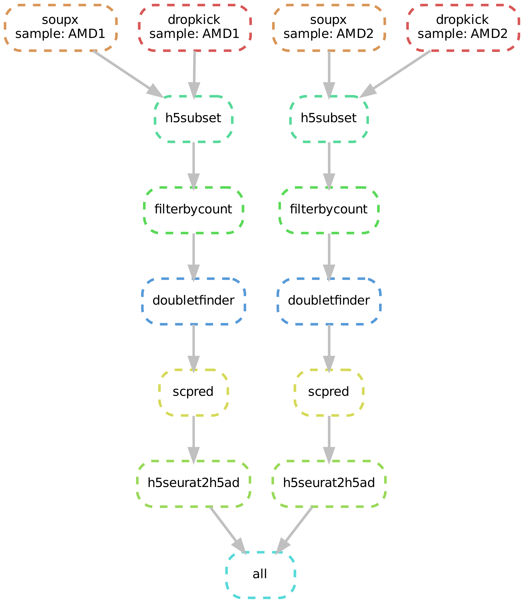

# cellqc: standardized quality control pipeline of single-cell RNA-Seq data

Cellqc standardizes the qualiy control of single-cell RNA-Seq (scRNA) data to render clean feature count matrices from Cell Ranger outputs. Cellqc is implemented using the Snakemake workflow management system to enhance reproduciblity and scalablity of data analysis. Briefly, the QC pipeline starts from raw count feature matrices from Cell Ranger. Dropkick filters out predicted empty droplets, and SoupX purify the transcriptome measurement by substracting the background trancripts. DoubletFinder further detects the potential doublets and retain clean count feature matrices for singlets. Cell types are annotated for clean cells by a reference database using scPred.


## Installation

Cellqc depends on a number of R and Python packages, so please install the dependencies before installing cellqc. It is encouraged to use Conda to install dependencies as much as possible. E.g.,

```
$ conda create -y -n cellqc
$ conda activate cellqc
$ conda config --add channels defaults --add channels bioconda --add channels conda-forge
$ conda install -y mamba
$ mamba install -y bioconductor-dropletutils r-seurat r-seuratobject r-dplyr r-ggplot2 'r-soupx>=1.6.2' r-scpred r-remotes scanpy pygraphviz snakemake click
$ Rscript -e "remotes::install_github(c('chris-mcginnis-ucsf/DoubletFinder', 'mojaveazure/seurat-disk'))"
$ mamba install -y numpy=1.21 # bug fix to install dropkick
$ mamba install -y anndata=0.7.8 # Fix .h5ad version
$ pip install dropkick
```

where dependent software are below.

| Software | URL |
|-------|-------|
| DoubletFinder | https://github.com/chris-mcginnis-ucsf/DoubletFinder |
| DropletUtils | https://bioconductor.org/packages/release/bioc/html/DropletUtils.html |
| Seurat | https://satijalab.org/seurat |
| SeuratDisk | https://github.com/mojaveazure/seurat-disk |
| SoupX | https://github.com/constantAmateur/SoupX |
| scPred | https://github.com/powellgenomicslab/scPred |
| Snakemake | https://github.com/snakemake/snakemake |
| Scanpy | https://scanpy.readthedocs.io/en/stable |
| dropkick | https://github.com/KenLauLab/dropkick |

After installing dependencies, to install the pipeline rules globally, this package can be installed via `pip`. Namely,

```
$ git clone https://github.com/lijinbio/cellqc.git
$ cd cellqc
$ pip install .
```

An example Bash script to wrap up above commands can be found at `dep.sh`.

To test the installation, simply run

```
$ cellqc -h
```

## Run the pipeline

There are two ways to run the pipeline. One is to call the global rule by the installed `cellqc`, and the other is to copy a local rule and run the pipeline manually by `snakemake`. Both ways reqiure a configuration file in the YAML format for pipeline parameters, as well as a sample file for input Cell Ranger directories. See an example below.

### Inspection of configuration

The configuration file is in a YAML format. An example configuration can be found at the example directory. 

1. samples

This is a sample file (e.g., `samples.txt`) tab-delimited with headers: `sample`, `cellranger`, and/or `nreaction`. The `sample` column is the sample ID per sample, and the `cellranger` is its Cell Ranger output directory. The third column `nreaction` is the number of reactions in the library preparation, which is useful to infer expected doublets for a sample with a Cell Ranger analysis using combined raw reads from multiple reactions. If the `nreaction` column is not specified in the sample file, the default 1 reaction is used for all samples.

2. dropkick

This section defines two parameters for empty droplet removal by dropkick.

| Parameter | Description |
|-------|-------|
| dropkick.skip | Skip [Dropkick](https://github.com/KenLauLab/dropkick) and use the estimated cells from Cell Ranger alone (using [EmptyDrops](https://support.10xgenomics.com/single-cell-gene-expression/software/pipelines/latest/algorithms/overview#cell_calling)) if set `true`. If set `false`, to estimate further empty droplets by Dropkick. Be cautious that Dropdick might predict a significant number of false negatives for a poor library. |
| dropkick.method | The thresholding method for labeling the training data for true cells, such as multiotsu, otsu, li, or mean. |
| dropkick.numthreads | Number of threads. Dropkick will use significant memory. One thread is suggested for this step. |

3. filterbycount

To filter cells by nCount, nFeature, and percentage of mitochondria reads.

| Parameter | Description |
|-------|-------|
| filterbycount.mincount | Minimum counts for a cell. |
| filterbycount.minfeature | Minimum features for a cell. |
| filterbycount.mito | Maximum percentage of mitocondria transcripts. |

4. doubletfinder

This section includes three parameters for doublet removal by DoubletFinder.

| Parameter | Description |
|-------|-------|
| doubletfinder.findpK | To estimate the neighbor size (pK) by mean-variance bimodality coefficients if `true`. If set `false`, skip the estimation and use the preset pK value. |
| doubletfinder.numthreads | Number of threads. |
| doubletfinder.pK | A preset neighbor size (pK). Will be used if `doubletfinder.findpK=false`.|

5. scpred

A pre-trained classifier for cell-type annotation by scPred.

| Parameter | Description |
|-------|-------|
| scpred.skip | Skip the automated cell type prediction by scPred if `true`. This is useful for a sample without a pre-trained reference. |
| scpred.reference | The pre-trained reference classifier saved in a RDS file. See https://github.com/powellgenomicslab/scPred |
| scpred.threshold | Threshold for a positive prediction. |

### Result files

Three result files are generated under a `result` directory. `result/*.h5seurat` and `result/*.h5ad` files are count matrices after processing with QC metrics such as "pANN" for proportion of artificial nearest neighbors, and/or "scpred_prediction" for predicted cell type. A report file `result/qc_report.html` is a summary of QC metrics.

### An example

This example demonstrates the pipeline on two AMD samples. The test data consists of Cell Ranger output directories of two AMD samples, as well as a pretrained calssifier for cell-type annotation.

https://bcm.box.com/s/nnlmgxh8avagje93cih20g1dsxx14if4

By feeding the file locations, below is an example configuration file `config.yaml` and a sample file `sample.txt`.

```
$ cat config.yaml
# samples with Cell Ranger output directories
samples: /path/to/samples.txt

## configuration for dropkick
dropkick:
  skip: true
  method: multiotsu
  numthreads: 1

## Filter cells by nCount, nFeature, and mito
filterbycount:
  mincount: 500
  minfeature: 300
  mito: 5

## configuration for DoubletFinder
doubletfinder:
  findpK: false
  numthreads: 5
  pK: 0.005

## configuration for scPred
scpred:
  skip: false
  reference: /path/to/scPred_reference.rds
  threshold: 0.9
```

```
$ cat sample.txt
sample	cellranger	nreaction
AMD1	/path/to/cellqc_test_data/AMD1	1
AMD2	/path/to/cellqc_test_data/AMD2	1
```

Below command is to run the pipeline by the installed entrypoint `cellqc`.

```
$ cellqc -c config.yaml
```

Alternatively, the pipeline rules can be copied to a local directory, and run manually under the local directory using `snakemake`.

```
$ git clone https://github.com/lijinbio/cellqc.git
$ cp -R cellqc/cellqc /path/to/local
# edit config.yaml and sample.txt under the local directory
$ snakemake -j 4 --configfile config.yaml
$ snakemake -j 4 --configfile config.yaml --report report.html
$ snakemake -j 4 --configfile config.yaml --dag | tee dag.dot | dot -Tpdf > dag.pdf
```

A directed acyclic graph (DAG) of jobs will be generated. For example,



A report of result files will be also produced, such as [report.html](https://github.com/lijinbio/cellqc/blob/master/docs/tests/report.html).

